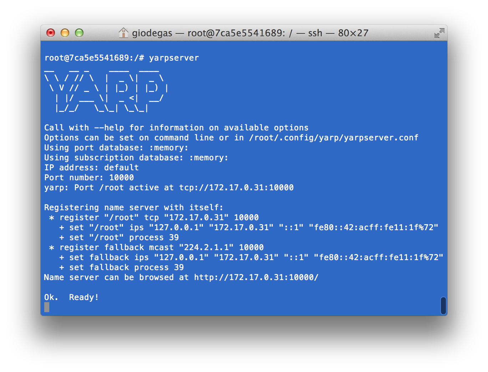
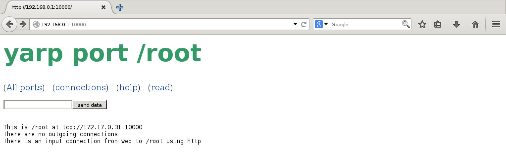

# docker-yarp
docker container for YARP: Yet Another Robotic Platform middleware - http://wiki.icub.org/yarp/

to install as a new image on docker:

    docker pull giodegas/yarp

to start a shell:

    docker run -it giodegas/yarp bash
    
to check installation:

    yarp check
    
you shoudl get:

    yarp: ==================================================================
    yarp: === This is "yarp check"
    yarp: === It is a very simple sanity check for your installation
    yarp: === If it freezes, try deleting the file reported by "yarp conf"
    yarp: === Also, if you are mixing terminal types, e.g. bash/cmd.exe
    yarp: === on windows, make sure the "yarp conf" file is the same on each
    yarp: ==================================================================
    yarp: === Trying to register some ports
    yarp: === NO NAME SERVER!  Switching to local, fake mode
    yarp: Port /tmp/port/1 active at tcp://127.0.0.1:10002
    yarp: Port /tmp/port/2 active at tcp://127.0.0.1:10012
    yarp: ==================================================================
    yarp: === Trying to connect some ports
    yarp: Receiving input from /tmp/port/2 to /tmp/port/1 using tcp
    yarp: Sending output from /tmp/port/2 to /tmp/port/1 using tcp
    Success: Added connection from /tmp/port/2 to tcp://tmp/port/1
    yarp: ==================================================================
    yarp: === Trying to write some data
    yarp: ==================================================================
    yarp: === Trying to read some data
    yarp: *** Read number 42
    yarp: ==================================================================
    yarp: === Trying to close some ports
    yarp: Removing input from /tmp/port/2 to /tmp/port/1
    yarp: Removing output from /tmp/port/2 to /tmp/port/1
    yarp: *** YARP seems okay, but there is no name server available.

to start and use the YARP server, I suggest to define first a secondary non-routable IP to your network device on the host machine, before launching the docker image:

	sudo ifconfig eth0:1 192.168.0.1/24
	
then restart the docker image specifying the port mapping between the external IP and internal service on port 10000, (you can change the first setting 192.168.0.1:10000 with the one most appropriate with your setting):

	docker run -it -p 192.168.0.1:10000:10000 giodegas/yarp bash
	
then from the docker image:

    yarpserver
    
which should give you something like this:

you can now open a browser session to [http://192.168.0.1:10000](http://192.168.0.1:10000) :

